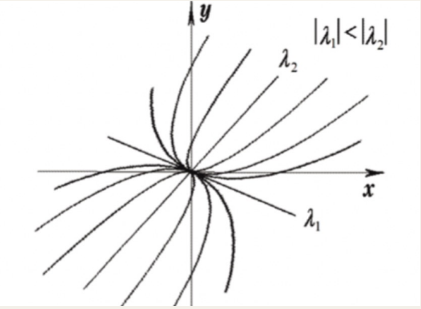
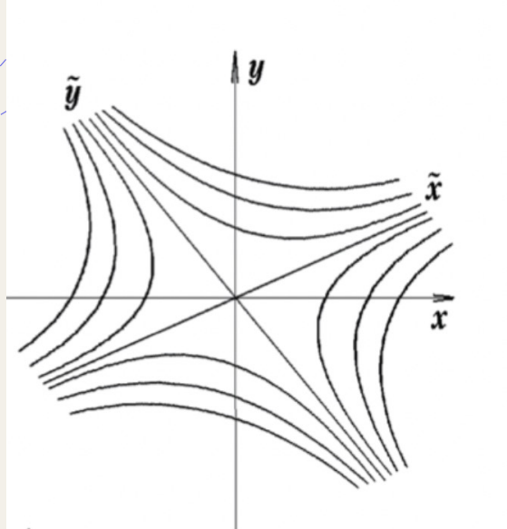
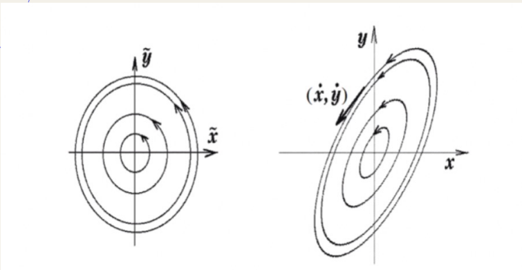
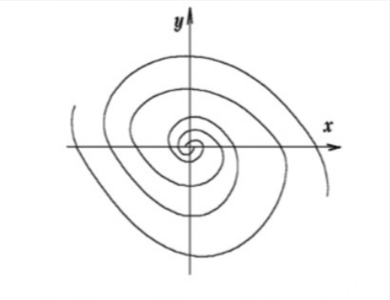
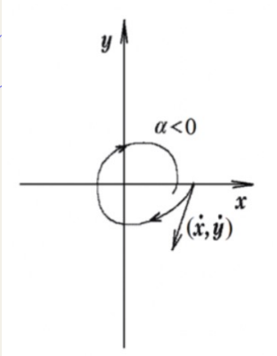
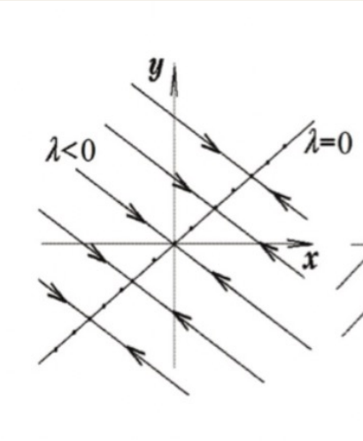
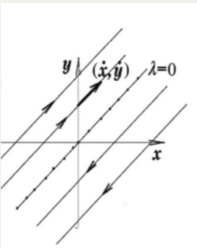

# 1. Решение однородной системы линейных дифференциальных уравнений в случае простых корней. Пример.

## Фундаментальная система решений

Фундаментальная система решений - набор из $n$ решений системы

$\begin{cases}
    \dot{x_1} = a_{11}(b)x_1+a_{12}(b)x_2+...+a_{1n}(b)x_n \\
    \dot{x_2}=a_{21}(b)x_1+a_{22}(b)x_2+...+a_{2n}(b)x_n \\
    ... \\
    \dot{x_n} = a_{n1}(b)x_1+a_{n2}(b)x_2+...+a_{nn}(b)x_n
\end{cases}$

если вектор-функции $(x_n)$ входящие в него линейно-независимые

## Теорема о структуре решения однородной системы

Общее решение системы имеет вид

$x_{о.о}=C_1x^1+C_2x^2+...+C_nx^n,$\
где $x^i-$ ФСР; $C_i-$ вещественная константа

$(1)\ \dot{x}=Ax$

$x=\begin{pmatrix}
    h_1e^{\lambda t} \\
    h_2e^{\lambda t} \\
    h_3e^{\lambda t} \\
\end{pmatrix}= he^{\lambda t}\ (2)$

$h\lambda e^{\lambda t}=Ah\lambda e^{\lambda t}$ \
$Ah=\lambda h$

$\bold{Лемма.}$ Для того, чтобы функция вида (2) была решением системы (1) необходимо и достаточно, чтобы $\lambda$ было собственным значением матрицы $A,$ а $h-$ соответствовало собствнному вектору

У матрицы $n\times n$ существует $n$ собственных значений(с учетом кратных)

$detA(A-\lambda E)=0$

## Простые корни

Пусть $\lambda_{1,2}-$ простые и вещественные, и пусть $h^n$ соответствующие им собственные векторы. Тогда вектор функции $h^1e^{\lambda_1 t},...,h^ne^{\lambda_n t}$ образуют ФСР.

$W(t)=|h^1e^{\lambda_1 t},...,h^ne^{\lambda_n t}|=e^{\lambda_1t+...+\lambda_n t}|h^1,...,h^n|\neq 0$ т.к $h^1,...,h^n$ образуют базис

# 2. Решение однородной системы линейных дифференциальных уравнений в случае комплексных корней. Пример.

## Фундаментальная система решений

Фундаментальная система решений - набор из $n$ решений системы

$\begin{cases}
    \dot{x_1} = a_{11}(b)x_1+a_{12}(b)x_2+...+a_{1n}(b)x_n \\
    \dot{x_2}=a_{21}(b)x_1+a_{22}(b)x_2+...+a_{2n}(b)x_n \\
    ... \\
    \dot{x_n} = a_{n1}(b)x_1+a_{n2}(b)x_2+...+a_{nn}(b)x_n
\end{cases}$

если вектор-функции $(x_n)$ входящие в него линейно-независимые

## Теорема о структуре решения однородной системы

Общее решение системы имеет вид

$x_{о.о}=C_1x^1+C_2x^2+...+C_nx^n,$\
где $x^i-$ ФСР; $C_i-$ вещественная константа

$(1)\ \dot{x}=Ax$

$x=\begin{pmatrix}
    h_1e^{\lambda t} \\
    h_2e^{\lambda t} \\
    h_3e^{\lambda t} \\
\end{pmatrix}= he^{\lambda t}\ (2)$

$h\lambda e^{\lambda t}=Ah\lambda e^{\lambda t}$ \
$Ah=\lambda h$

$\bold{Лемма.}$ Для того, чтобы функция вида (2) была решением системы (1) необходимо и достаточно, чтобы $\lambda$ было собственным значением матрицы $A,$ а $h-$ соответствовало собствнному вектору

У матрицы $n\times n$ существует $n$ собственных значений(с учетом кратных)

$detA(A-\lambda E)=0$

## Комплексные корни

$\dot{x}=Ax$

Пусть $z$ может быть комплексно значным. $\dot{z}=Az$

Пусть $\lambda_1,...,\lambda_n-$ простые собственные значения(могут быть как комплексными, так и вещественными) и $h^1,...,h^n-$ соответствующие им собственные векторы(могут быть комплексными и вещественными).\
Тогда $h^1e^{\lambda_1t},...,h^ne^{\lambda_nt}-ФСР$

$W(t)=|h^1e^{\lambda_1 t},...,h^ne^{\lambda_n t}|=e^{\lambda_1t+...+\lambda_n t}|h^1,...,h^n|\neq 0$ т.к $h^1,...,h^n$ образуют базис

Т.к $A-$ вещественная матрица $\Rightarrow|A-\lambda E|=0\Rightarrow$ если $\alpha+i\beta -$ корень, то и $\alpha-i\beta -$ Тоже корень

$\begin{matrix}
    c.з && с.в \\
    \alpha+i\beta && f+ig \\
    \alpha-i\beta && f-ig
\end{matrix}$

Преобразование Эйлера $e^{i\phi}=\cos{\phi}+i\sin{\phi}$

$C_1(f+ig)e^{(\alpha+i\beta)t}+C_2(f-ig)e^{(\alpha-i\beta)t}=C_1(f+ig)e^{\alpha t}(\cos{\beta t}+i\sin{\beta t})+C_2(f-ig)e^{\alpha t}(\cos{\beta t}-i\sin{\beta t})=e^{\alpha t}(\underbrace{(C_1+C_2)}_{A}(f\cos{\beta t}-g\sin{\beta t})+\underbrace{(C_1-C_2)}_{B}i(g\cos{\beta t}+f\sin{\beta t}))$

$A=C_1+C_2=2a_1$\
$B=(C_1-C_2)i=2b_1i-i=-2b_1$

$C_1=a_1+b_1i$\
$C_2=a_1-b_1i$

# 3. Решение однородной системы линейных дифференциальных уравнений в случае кратных вещественных корней. Пример.

## Фундаментальная система решений

Фундаментальная система решений - набор из $n$ решений системы

$\begin{cases}
    \dot{x_1} = a_{11}(b)x_1+a_{12}(b)x_2+...+a_{1n}(b)x_n \\
    \dot{x_2}=a_{21}(b)x_1+a_{22}(b)x_2+...+a_{2n}(b)x_n \\
    ... \\
    \dot{x_n} = a_{n1}(b)x_1+a_{n2}(b)x_2+...+a_{nn}(b)x_n
\end{cases}$

если вектор-функции $(x_n)$ входящие в него линейно-независимые

## Теорема о структуре решения однородной системы

Общее решение системы имеет вид

$x_{о.о}=C_1x^1+C_2x^2+...+C_nx^n,$\
где $x^i-$ ФСР; $C_i-$ вещественная константа

$(1)\ \dot{x}=Ax$

$x=\begin{pmatrix}
    h_1e^{\lambda t} \\
     h_2e^{\lambda t} \\
      h_3e^{\lambda t} \\
\end{pmatrix}= he^{\lambda t}\ (2)$

$h\lambda e^{\lambda t}=Ah\lambda e^{\lambda t}$ \
$Ah=\lambda h$

$\bold{Лемма.}$ Для того, чтобы функция вида (2) была решением системы (1) необходимо и достаточно, чтобы $\lambda$ было собственным значением матрицы $A,$ а $h-$ соответствовало собствнному вектору

У матрицы $n\times n$ существует $n$ собственных значений(с учетом кратных)

$detA(A-\lambda E)=0$

Пусть кратность $\lambda=k$

$r=rank(A-\lambda E)$ \
$m=n-r$

$m=k$

Найти $k$ векторов

$\dot{x}=Ax$ \
$x=(h^1t +h^2)e^{\lambda t}$\
$h^1e^{\lambda t}+\lambda(h^1t+h^2)e^{\lambda t}=A(h^1+h^2)e^{\lambda t}$ \
$h^1+\lambda h^1 t+\lambda h^2=Ah^1t+Ah^2$\
$h^1+\lambda h^2=Ah^2$\
$Ah^1=\lambda h^1$

Пусть $n=3$

1. k=2\
   а) Есть 2 собственных вектора или 2 независимых\
   б) Есть 1 собственный вектор и 1 присоединенный вектор

2. k=3\
   $\underbrace{h_1}_{собственный\ вектор},\underbrace{h_2,h_3}_{присоединенные\ вектора }$\
   $x^1=e^{\lambda t}h^1$\
   $x^2=e^{\lambda t}(h^1t+h^2)$\
   $x^3=e^{\lambda t}(\frac{t^2}{2}h^1+th^2+h^3)$

# 4. Линейная зависимость и независимость систем функций. Решение примеров на исследование линейной зависимости функций. Определитель Вронского для систем. Теорема об определителе Вронского. Пример.

Система функций $\phi_1,...,\phi_n$ называется линейно зависимой, если существует такой ненулевой набор констант, что $C_1,\phi_1+...+C_n\phi_n=0$\
Если такой комбинации не существует, то функции называются линейно независимыми.

Пусть $x^1(t)=\begin{pmatrix}
    x^1(t)\\
    x^1_2(t)\\
    ...\\
    x^1_n(t)
\end{pmatrix},...,x^n(t)=\begin{pmatrix}
x^n_1(t)\\
x^n_2(t)\\
...\\
x^n_n(t)
\end{pmatrix}-$ набор вектор функций, который является набором решений системы\
$\begin{cases}
    \dot{x}_1=a_{11}(b)x_1+a_{12}(b)x_2+...+a_{1n}(b)x_n\\
    \dot{x}_2=a_{21}(b)x_1+a_{22}(b)x_2+...+a_{2n}(b)x_n\\
    ...\\
    \dot{x}_n=a_{n1}(b)x_1+a_{n2}(b)x_2+...+a_{nn}(b)x_n
\end{cases}$

Тогда определителем Вронского системы решений называется:
$W(t)=\begin{vmatrix}
    x_1^1(t) && x^2_1(t) && ... && x^n_1(t)\\
    ... && ... && ... && ... \\
    x^1_n(t) && x^2_n(t) && ... && x^n_n(t)
\end{vmatrix}$

## Теорема об определителе Вронского.

Пусть на промежутке $X$ непрерывны коэффициенты $p_1(x),...,p_n(x)$ однородного дифференциального уравнения\
$y^{(n)}+p_1(x)y^{(n-1)}+...+p_n(x)y=0\qquad(1)$

Для того, чтобы решения $y_1,y_2,...,y_n-$ были линейно независимы на $X,$ необходимо и достаточно, чтобы хотя бы в одной точке $x_0$ этого промежутка их вронскиан был отличен от нуля. В этом случае он будет отличен от нуля и в остальных точках того же промежутка.

$\bold{Доказательство}$

Система векторов
$\begin{cases}
    y_1=(y_{11},...,y_{1n}),\\
    ...\\
    y_n=(y_{n1},...,y_{nn})
\end{cases}$ в пространстве $\mathbb{R}^n$ линейно независима в том и только в том случае, когда отличен от нуля определитель $\begin{vmatrix}
    y_{11} && y_{12} && ... && y_{1n}\\
    y_{21} && y_{22} && ... && y_{2n}\\
    ... && ... && ... && ...\\
    y_{n1} && y_{n2} && ... && y_{nn}
\end{vmatrix},$ составленный из координат этих векторов.

Множество решений уравнения (1) образует вектороное простарнство $S^n$. По теореме о существованиии единственности решений ОДУ, если задано начальное условие, то существует единственное решение уравнения. Значит каждому решению в $S$ можно сопоставить вектор в $\mathbb{R}^n.$ Тогда решения $y_1,...,y_n-$ линейно независимы только если линейно независимы соответствуеюшие им векторы $y_1,...,y_n$ с координатами $y_k=(y_k(x_0),y'_k(x_0),...,y_k^{(n-1)}(x_0)),\quad 1\leq k\leq n$

Это будет только в том случае, когда отличен от 0 определитель $\begin{vmatrix}
    y_1(x_0) && y_1^1(x_0) && ... && y_1^{(n-1)}(x_0)\\
    y_2(x_0) && y_2^1(x_0) && ... && y_2^{(n-1)}(x_0)\\
    ... && ... && ... && ...\\
    y_n(x_0) && y_n^1(x_0) && ... && y_n^{(n-1)}(x_0)
\end{vmatrix}(2),$ составленный из координат этих векторов. 

Определитель (2) является значением в точке $x_0$ определителя $W(y_1,...,y_n)=\begin{vmatrix}
    y_1(x) && y_1^1(x) && ... && y_1^{(n-1)}(x)\\
    ... && ... && ... && ...\\
    y_n(x) && y_n^1(x) && ... && y_n^{(n-1)}(x)
\end{vmatrix},$ и называется определителем Вронского(вронскианом)

# 5. Теорема о 3-х типах фазовых траекторий автономных систем. Классификация особых точек. Особые точки линейной системы: узел, седло. Пример.

## Теорема о 3-х типах фазовых траекториях.

Автономная система

$\dot{x}=f(x)\ (1)$

в $\mathbb{R}^n$ может иметь только три типа фазовых траекторий:

1. Точка
2. Замкнутая кривая без самопересечения (цикл)
3. Незамкнутая кривая без самопересечения

$\bold{Доказательство}$

Если решение $x(t)=const,$ то траектория - точка. Если $x(t_1)\neq x(t_2)$ при любых $t_1,t_2,t_1\neq t_2,$ то траектория незамкнутая кривая без самопересечений. Если $x(t)\neq const$ и $x(t_1)=x(t_2)$ при некоторых $t_1,t_2\neq t_1,$ то траектория - замкнутая кривая.

## Классификация особых точек.

$\begin{cases}
    \dot{x}=f(x,y) \\
    \dot{y}=g(x,y)
\end{cases}$

Если правые части системы $\neq0,$ то $\frac{dy}{dx}=\frac{g(x,y)}{f(x,y)}$

Точки, в которых $\begin{cases}
    f(x,y) = 0 \\
    g(x,y) = 0
\end{cases}$ называются особыми точками или стационарными или точками равновесия

$\begin{cases}
    \dot{x}=ax+by \\
    \dot{y}=cx+dy
\end{cases}$

$A=\begin{pmatrix}
    a && b \\
    c && d
\end{pmatrix}$

$A=TJT^{-1}$ \
$J=T^{-1}AT$

Замена\
$\begin{pmatrix}
    x \\
    y
\end{pmatrix}=$ $T\begin{pmatrix}
    \widetilde{x} \\
    \widetilde{y}
\end{pmatrix}$

$\begin{pmatrix}
    \dot{x} \\
    \dot{y}
\end{pmatrix}=$ $A\begin{pmatrix}
    x \\
    y
\end{pmatrix}$

$\begin{pmatrix}
    \dot{\widetilde{x}} \\ 
    \dot{\widetilde{y}}
\end{pmatrix}=$ $J\begin{pmatrix}
    \widetilde{x} \\
    \widetilde{y}
\end{pmatrix}$

## Узел

$J=\begin{pmatrix}
    \lambda_1 && 0 \\
    0 && \lambda_2
\end{pmatrix}$

$\lambda_{1,2}-$ собственные значения матрицы $A$

$\begin{cases}
    \dot{\widetilde{x}}=\lambda_1\widetilde{x} \\ 
    \dot{\widetilde{y}}=\lambda_2\widetilde{y}
\end{cases}$

$\frac{d\widetilde{y}}{d\widetilde{x}}=\frac{\lambda_2}{\lambda_1}\cdot\frac{\widetilde{y}}{\widetilde{x}}$

$\lambda_1\neq\lambda_2$ \
$\lambda_{1,2}\in\mathbb{R}$\
$\lambda_1\cdot\lambda_2>0$

Если $\lambda_{1,2}<0,$ то движемся к особой точке$\Rightarrow$ устойчивый.

Если $\lambda_{1,2}>0,$ то движемся от особой точки $\Rightarrow$ неустойчивый.
$|\widetilde{y}|=C|\widetilde{x}|^{\frac{\lambda_2}{\lambda_1}}$

## Седло

$\lambda_1$ и $\lambda_2\in\mathbb{R}$

$\lambda_1\neq\lambda_2$

$\lambda_1\cdot\lambda_2<0\Rightarrow$ степень отрицательная $|\widetilde{y}|=C|\widetilde{x}|^{\frac{\lambda_2}{\lambda_1}}$

Если $\lambda_{1,2}<0,$ то движемся к особой точке$\Rightarrow$ устойчивое направление. Движемся вдоль вектора к О.Т

Если $\lambda_{1,2}>0,$ то движемся от особой точки $\Rightarrow$ неустойчивое направление. Движемся вдоль вектора от О.Т

# 6. Теорема о 3-х типах фазовых траекторий автономных систем. Классификация особых точек. Особые точки линейной системы: центр, фокус. Пример.

## Теорема о 3-х типах фазовых траекториях.

Автономная система

$\dot{x}=f(x)\ (1)$

в $\mathbb{R}^n$ может иметь только три типа фазовых траекторий:

1. Точка
2. Замкнутая кривая без самопересечения (цикл)
3. Незамкнутая кривая без самопересечения

$\bold{Доказательство}$

Если решение $x(t)=const,$ то траектория - точка. Если $x(t_1)\neq x(t_2)$ при любых $t_1,t_2,t_1\neq t_2,$ то траектория незамкнутая кривая без самопересечений. Если $x(t)\neq const$ и $x(t_1)=x(t_2)$ при некоторых $t_1,t_2\neq t_1,$ то траектория - замкнутая кривая.

## Классификация особых точек.

$\begin{cases}
    \dot{x}=f(x,y) \\
    \dot{y}=g(x,y)
\end{cases}$

Если правые части системы $\neq0,$ то $\frac{dy}{dx}=\frac{g(x,y)}{f(x,y)}$

Точки, в которых $\begin{cases}
    f(x,y) = 0 \\
    g(x,y) = 0
\end{cases}$ называются особыми точками или стационарными или точками равновесия

$\begin{cases}
    \dot{x}=ax+by \\
    \dot{y}=cx+dy
\end{cases}$

$A=\begin{pmatrix}
    a && b \\
    c && d
\end{pmatrix}$

$A=TJT^{-1}$ \
$J=T^{-1}AT$

Замена\
$\begin{pmatrix}
    x \\
    y
\end{pmatrix}=$ $T\begin{pmatrix}
    \widetilde{x} \\
    \widetilde{y}
\end{pmatrix}$

$\begin{pmatrix}
    \dot{x} \\
    \dot{y}
\end{pmatrix}=$ $A\begin{pmatrix}
    x \\
    y
\end{pmatrix}$

$\begin{pmatrix}
    \dot{\widetilde{x}} \\ 
    \dot{\widetilde{y}}
\end{pmatrix}=$ $J\begin{pmatrix}
    \widetilde{x} \\
    \widetilde{y}
\end{pmatrix}$

## Центр

Мнимые собственные значения

$J=\begin{pmatrix}
   0 && \beta \\
   -\beta && 0 
\end{pmatrix}$

$\lambda_{1,2}=\pm i\beta$

$\begin{cases}
    \widetilde{x}=\beta\widetilde{y} \\
    \widetilde{y}=-\beta\widetilde{x}
\end{cases}$

$\frac{d\widetilde{y}}{d\widetilde{x}}=-\frac{\widetilde{x}}{\widetilde{y}}\Rightarrow \widetilde{x}^2+\widetilde{y}^2=C$

## Фокус

Вещественно-комплексные с.з

$J=\begin{pmatrix}
   \alpha && \beta \\
   -\beta && \alpha
\end{pmatrix}$

$\lambda_{1,2}=\alpha\pm i\beta$

$\dot{\widetilde{x}}=\alpha\widetilde{x}+\beta\widetilde{y}$

$\begin{cases}
    \dot{\widetilde{x}}=\alpha\widetilde{x}+\beta\widetilde{y} \\
    \dot{\widetilde{y}}=-\beta\widetilde{x}+\alpha\widetilde{y}
\end{cases}$

Переходим к $(r,\phi)$

$\begin{cases}
    x=r\cos{\phi}\\
    y=r\sin{\phi}
\end{cases}$

$\begin{cases}
    \dot{r} = \alpha r\\
    \dot{\phi} = -\beta
\end{cases}$

$r=C\exp{(-\frac{\alpha}{\beta}\phi)}$

Направление определяем по $\alpha$

# 7. Теорема о 3-х типах фазовых траекторий автономных систем. Классификация особых точек. Особые точки линейной системы: вырожденные случаи. Пример.

## Теорема о 3-х типах фазовых траекториях.

Автономная система

$\dot{x}=f(x)\ (1)$

в $\mathbb{R}^n$ может иметь только три типа фазовых траекторий:

1. Точка
2. Замкнутая кривая без самопересечения (цикл)
3. Незамкнутая кривая без самопересечения

$\bold{Доказательство}$

Если решение $x(t)=const,$ то траектория - точка. Если $x(t_1)\neq x(t_2)$ при любых $t_1,t_2,t_1\neq t_2,$ то траектория незамкнутая кривая без самопересечений. Если $x(t)\neq const$ и $x(t_1)=x(t_2)$ при некоторых $t_1,t_2\neq t_1,$ то траектория - замкнутая кривая.

## Классификация особых точек.

$\begin{cases}
    \dot{x}=f(x,y) \\
    \dot{y}=g(x,y)
\end{cases}$

Если правые части системы $\neq0,$ то $\frac{dy}{dx}=\frac{g(x,y)}{f(x,y)}$

Точки, в которых $\begin{cases}
    f(x,y) = 0 \\
    g(x,y) = 0
\end{cases}$ называются особыми точками или стационарными или точками равновесия

$\begin{cases}
    \dot{x}=ax+by \\
    \dot{y}=cx+dy
\end{cases}$

$A=\begin{pmatrix}
    a && b \\
    c && d
\end{pmatrix}$

$A=TJT^{-1}$ \
$J=T^{-1}AT$

Замена\
$\begin{pmatrix}
    x \\
    y
\end{pmatrix}=$ $T\begin{pmatrix}
    \widetilde{x} \\
    \widetilde{y}
\end{pmatrix}$

$\begin{pmatrix}
    \dot{x} \\
    \dot{y}
\end{pmatrix}=$ $A\begin{pmatrix}
    x \\
    y
\end{pmatrix}$

$\begin{pmatrix}
    \dot{\widetilde{x}} \\ 
    \dot{\widetilde{y}}
\end{pmatrix}=$ $J\begin{pmatrix}
    \widetilde{x} \\
    \widetilde{y}
\end{pmatrix}$

## 1-ый вырожденный случай: 1 с.з = 0

Когда $detA=0$ или хотя бы 1 с.з = 0

$J=\begin{pmatrix}
    \lambda && 0\\
    0 && 0
\end{pmatrix}$

$\begin{cases}
    \dot{\widetilde{x}}=\lambda\widetilde{x} \\
    \dot{\widetilde{y}}=0
\end{cases}$

$\frac{d\widetilde{y}}{d\widetilde{x}}=0$

$\widetilde{y}=0$

## 2-ой вырожденный случай: оба с.з = 0

$J=\begin{pmatrix}
    0 && 1 \\
    0 && 0
\end{pmatrix}$

$\begin{cases}
    \dot{\widetilde{x}}=\widetilde{y} \\
    \dot{\widetilde{y}} = 0
\end{cases}$

# 8. Устойчивость. Теорема Ляпунова об устойчивости по первому приближению. Функция Ляпунова. Пример.

## Устойчивость

$(1)\ \dot{x}=f(t,x),\ x\in\mathbb{R}^n$ \
$(2)\ \dot{x}(t_0)=\overline{\xi}$

$\bold{Определение.}$

Решение $\overline{x}(t)$ системы (1) удовлетворяющее начальным условиям (2) и определенной на всей полуоси называется устойчивым по Ляпунову, если:

$\forall\epsilon>0\ \exist\ \delta=\delta(\epsilon)$ такое, что $\forall\xi: ||\xi-\overline{\xi}||<\delta$ выполняется:

1. Решение $x(t)$ удовлетворяет $x(t_0)=\xi$ существует на $[t_0;+\infin]$
2. $\forall\ t>t_0$ выполняется $||x(t)-\overline{x}(t)||<\epsilon$

## Устойчивость по первому приближению

$\bold{Теорема}$ Ляпунова об устойчивости по первому приближению.

$\dot{x}=f(x),\ x\in\mathbb{R}^n$

Пусть функция $f:\mathbb{R}^n$ удовлетворяет $f(0)=0,$ непрерывна и дифференцируема в нуле и все собственные значения матрицы частных производных $A=(\frac{dt}{dx}(0))$ имеют отрицательную вещественную часть, тогда нулевое решение системы $\dot{x}=f(x),$ $x\in\mathbb{R}^n$ ассимптотически устойчиво.

Решение называется ассимптотически устойчивым, если оно устойчиво по Ляпунову $\underbrace{||x(t)-\overline{x}(t)||}_{t\rightarrow\infin}\rightarrow 0$

Если все с.з $\neq0$, но хотя бы одно >0, то решение неустойчиво

Если хотя бы одно с.з = 0, то используем функцию Ляпунова

## Функция Ляпунова

$\begin{cases}
    \frac{dx}{dt}=f(x,y) \\
    \space\space\space\space\space\space\space\space\space\space\space\space\space\space\space\space\space\space\space\space\space\space\space\space (1) \\
    \frac{dy}{dt}=g(x,y)
\end{cases}$

Пусть $(0;0)-$ особая точка.

Если особая точка устойчива, то проекция убывает

$z=V(x,y): V(0,0)=0$ \
$V(x,y)>0,$ если $x,y\neq0$

$V(x,y)=V(x(t)y(t))$

$\underbrace{\frac{d(V(x(t)y(t)))}{dt}}_{производная\ в\ силу\ системы(1)}=\frac{dV}{dx}\cdot\frac{dx}{dt}+\frac{dV}{dy}\cdot\frac{dy}{dt}=\frac{dV}{dx}\cdot f(x,y)+\frac{dV}{dy}\cdot g(x,y)$

Если траектория подходит к 0 при $t\rightarrow\infin,$ то $\frac{dV}{dt}=0$

$\bold{Определение.}$ Говорят, что функция $V(x):\mathbb{R}^2\rightarrow\mathbb{R}^+$ является функцией Ляпунова системы (1), если:

1. $V(x)$ непрерывно дифференцируема
2. $V(0)=0,\ V(\infin)=\infin$
3. $V(x)>0$ при $x\neq0$
4. Производная функции в силу системы (1) строго отрицательна (или неположительна) или строго положительна на всем $\mathbb{R}^n,$ кроме 0

## Теорема о функции Ляпунова

Пусть система (1) имеет нулевое положение равновесия(особую точку) $f(0)=0,\ g(0)=0$ и пусть $V(x)-$ функция Ляпунова для этой системы.Если при этом ее производная в силу системы неположительна, то нулевое решение системы устойчиво по Ляпунову. Если знак неравенства строгий, то нулевое решение системы ассимптотически устойчиво. Если производная в силу системы положительна, то нулевое решение неустойчиво.
