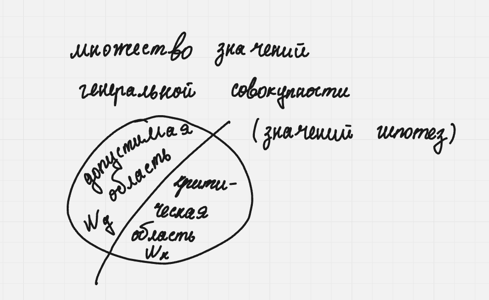

# 1. Числовые характеристики случайных величин: математическое ожидание, дисперсия, ковариация, коэффициент корреляции, центральные и начальные моменты высших порядков, квантили, моды, энтропии, условные числовые характеристики. Определения. Свойства. Доказательства свойств. Вывод формул расчета числовых характеристик для основных распределений.

## Математическое ожидание

### Дискретная случайная величина

Математическим ожиданием(средним значением) $M_\xi$ дискретной случайной величины $\xi$ называется сумма произведений значений $X_i$ случайной величины на вероятности $p_i=P\{\xi=X_i\},$ с которым эти значения принимаются:

$$M_xi=\sum_iX_ip_i.$$

Причем, если с.в $\xi$ принимает счетное число значений, то необходимо, чтобы

$$\sum_i|X_i|p_i<\infin$$

Иначен говорят, что мат. ожидания не существует.

Для двумерной дискретной случайной величины $\xi$ и $\eta$ мат. ожидание:

$$M_{\xi\eta}=\sum_i\sum_jX_iY_jp_{ij}$$

### Непрерывная случайная величина

Если с.в $\xi$ непрерывна, то она принимает значение $x$ с вероятностью $p(x)dx.$ Заменяя сумму на интеграл, получаем:

$$M_\xi=\int_{-\infin}^{+\infin}xp_\xi(x)dx$$

Условие существования:

$$\int_{-\infin}^{+\infin}|x|p_\xi(x)dx<\infin$$

Для двумерной непрерывной случайной величины $\xi$ и $\eta$ мат. ожидание:

$$M_{\xi\eta}=\int_{-\infin}^{+\infin}dx\int_{-\infin}^{+\infin}xyp_{\xi\eta}dy$$

### Свойства математического ожидания

$\bold{Свойство\ 1.}$

$Mconst=const$

$\bold{Доказательство.}$

Среднее значение константы = самой константе

$\bold{Свойство\ 2.}$

$M(a\xi)=aM_\xi$

$\bold{Доказательство.}$

$M(a\xi)=\int_{-\infin}^\infin axp_\xi(x)dx=a\int_{-\infin}^\infin xp_\xi(x)dx=aM_\xi$

$\bold{Свойство\ 3.}$

$M(\xi+\eta)=M_\xi+M_\eta$

$\bold{Доказательство.}$

Пусть $\xi_1,\xi_2-$ двумерная дискретная с.в. $X_i=\xi_1, Y_j=\xi_2$

$M_\eta=\sum_{i,j}(X_i+Y_j)P\{\xi_1=X_i,\xi_2=Y_j\}=\sum_iX_i(\sum_jP\{\xi_1=X_i,\xi_2=Y_j\})+\sum_jY_j(\sum_iP\{\xi_1=X_i,\xi_2=Y_j\})=\sum_iX_iP\{\xi_1=X_i\}+\sum_jY_jP\{\xi_2=Y_j\}=M_{\xi_1}+M_{\xi_2}$

$\bold{Свойство\ 4.}$ Если с.в независимы

$M(\xi\eta)=M_\xi\cdot M_\eta$

$\bold{Доказательство.}$

$M(\xi_1\cdot\xi_2)=\int\int xyp_{\xi_1}(x)p_{\xi_2}(y)dydx=\int xp_{\xi_1}(x)dx\int p_{\xi_2}(y)dy=M_{\xi_1}\cdot M_{\xi_2}$

## Дисперсия

$\bold{Определение.}$ Дисперсией $D_\xi$ называется

$$D_\xi = M(\xi-M_{\xi})^2=\sum_i(X_i-M_\xi)^2p_i\ - \ для\ дискретных\ с.в$$

$$D_\xi = M(\xi-M_{\xi})^2=\int_{-\infin}^{+\infin}(x-M_\xi)^2p_\xi(x)dx\ -\ для\ непрерывных\ с.в$$

$$D_\xi=M_{(\xi)^2}-(M_\xi)^2\ -\ универсальная\ формула $$

$\bold{Определение.}$ Вторым(начальным) моментом с.в $\xi$ называется мат. ожидание квадрата $\xi$

$$M_{(\xi^2)}=\sum_iX^2_ip_i\ -\ для\ дискретной\ с.в$$

$$M_{(\xi^2)}=\int_{-\infin}^{+\infin}x^2p_\xi(x)dx\ -\ для \ непрерывной\ с.в$$

$\bold{Определение.}$ Начальным моментом с.в $\xi$ называется мат. ожидание $k-ой$ степени с.в $\xi:$

$$M_{(\xi)^k}=\sum_iX_i^kp_i\ -\ для\ дискретных\ с.в$$

$$M_{(\xi)^k} = \int_{-\infin}^{+\infin}x^kp_\xi(x)dx\ - для\ непрерывных\ с.в$$

$\bold{Определение.}$ Центральным моментом с.в $\xi$ называется мат. ожидание $k-ой$ степени с.в $\xi=\xi-M_\xi:$

$$M(\xi-M_{\xi})^k=\sum_i(X_i-M_\xi)^kp_i\ -\ для\ дискретных\ с.в$$

$$M(\xi-M_{\xi})^k=\int_{-\infin}^{+\infin}(x-M_\xi)^kp_\xi(x)dx\ -\ для\ непрерывных\ с.в$$

### Свойства дисперсии

$\bold{Свойство\ 1.}$

$D(const)=0$

$\bold{Доказательство.}$

$D_a=M(a-M_a)^2=M(a-a)^2=0$

$\bold{Свойство\ 2.}$

$D(a\xi+b)=a^2D_\xi$

$\bold{Доказательство.}$

$D(a\xi)=M(a\xi-M(a\xi))=M(a^2(\xi-M_\xi))=a^2D(\xi)$

$\bold{Свойство\ 3.}$ Если с.в независимы

$D(\xi+\eta)=D_\xi+D_\eta$

$\bold{Свойство\ 4.}$ Если с.в зависимы

$D(\xi+\eta)=D_\xi+D_\eta+2Cov(\xi,\eta)$

$\bold{Доказательство.}$

$D(\xi+\eta)=M((\xi+\eta)-M(\xi+\eta))^2=M(\xi+\eta-M\xi-M\eta)^2=M((\xi-M\xi)+(\eta-M\eta))^2=M(\xi-M\xi)^2+M(2(\xi-M\xi)(\eta-M\eta))+M(\eta-M\eta)^2=D\xi+D\eta+2Cov(\xi,\eta)$

## Ковариация

$\bold{Определение.}$ Ковариацией с.в $\xi$ и $\eta$ называется мат. ожидание произведения центрированных с.в

$\xi=\xi-M_\xi$

$\eta=\eta-M-\eta$

$$Cov(\xi,\eta)=M(\xi,\eta) = M[(\xi-M_\xi)(\eta-M_\eta)]$$

$$Cov(\xi,\eta)=\sum_i\sum_j(X_i-M_\xi)(Y_j-M_\eta)p_{ij}\ -\ для\ дискретных\ с.в$$

$$Cov(\xi,\eta)=\iint(x-M_\xi)(y-M_\eta)p_{\xi\eta}(x,y)dxdy\ -\ для\ непрерывных\ с.в$$

### Свойства ковариации

$\bold{Свойство\ 1.}$

$Cov(\xi,\xi)=D_\xi$

$\bold{Доказательство.}$

$Cov(\xi,\xi)=M((\xi-M\xi)(\xi-M\xi))=M(\xi-M\xi)^2=D\xi$

$\bold{Свойство\ 2.}$ Если с.в независимы

$Cov(\xi,\eta)=0$

$\bold{Свойство\ 3.}$

$Cov(a\xi+b,c\eta+d)=acCov(\xi,\eta)$

$\bold{Свойство\ 4.}$

$-\sqrt{D_\xi\cdot D_\eta}\leq Cov(\xi,\eta)\leq \sqrt{D_\xi\cdot D_\eta}$

$\bold{Свойство\ 5.}$ Только, когда с.в линейно зависимы

$Cov(\xi,\eta)=\pm\sqrt{D_\xi\cdot D_\eta}$

$\bold{Свойство\ 6.}$ Расчетная формула

$Cov(\xi,\eta)=M_{(\xi\cdot \eta)}-M_\xi\cdot M_\eta$

$M_{(\xi\cdot \eta)} = \sum_i\sum_j X_iY_jp_{ij} \ -\ для\ дискретных\ с.в$

$M_{(\xi\cdot \eta)} = \iint_{-\infin}^{+\infin}xyp_{\xi\eta}(x,y)dxdy\ - для\ непрерывных\ с.в$

## Коэффициент корреляции

$\bold{Определение.}$ Коэффициентом корреляции с.в $\xi$ и $\eta$ называется число, определяемое выражением:

$$\rho_{\xi\eta}=\frac{Cov(\xi,\eta)}{\sqrt{D_\xi\cdot D_\eta}}$$

### Свойства корреляции

$\bold{Свойство\ 1.}$

$\rho_{\xi\xi}=1$

$\bold{Свойство\ 2.}$ Если с.в независимы

$\rho_{\xi\eta}=0$

$\bold{Свойство\ 3.}$

$\rho_{a_1\xi+b_1,a_2\eta+b_2}=\pm\rho_{\xi,\eta}$

Причем знак "+" берется, если $a_1,a_2>0$ и знак "-", если $a_1,a_2<0$

$\bold{Свойство\ 4.}$

$-1\leq\rho_{\xi,\eta}\leq 1$

$\bold{Свойство\ 5.}$ Только, когда с.в линейно зависимы

$\rho_{\xi,\eta}=\pm 1$

## Квантили

$\bold{Определение.}$ $\alpha-квантилью$ $Q_\alpha(0<\alpha<1)$ с.в $\xi$ называется число, удовлетворяющее неравенствам $P\{\xi<Q_\alpha\}\leq\alpha$ и $\{\xi>Q_\alpha\}\leq 1- \alpha$

$1/2-квантиль$ называется медианой $M$ с.в $\xi$

## Мода

### Непрерывные

$\bold{Определение.}$ Модой непрерывной с.в называется точка (локального) максимума плотности распределения $p(x)$.

1. Унимодальное распределение - распределение, имеющее 1 моду.
2. Бимодальное распределение - распределение, имеющее 2 моды.
3. Мультимодальное распределение - распределение, имеющее несколько мод.

### Дискретные

Пусть $X_1,...,X_n$ расположены в порядке возрастания.

$\bold{Определение.}$ Модой дискретной с.в называется такое значение $X_i,$ что $p_{i-1}<p_i$ и $p_{i+1}<p_i.$

1. Унимодальное распределение - распределение, имеющее 1 моду.
2. Бимодальное распределение - распределение, имеющее 2 моды.
3. Мультимодальное распределение - распределение, имеющее несколько мод.

## Энтропия

### Дискретный случай

$\bold{Определение.}$ Энтропия $H=H(\xi)$ дискретной с.в $\xi$ определяется формулой :

$$H=H(\xi)=-\sum_{i=1}^np_i\ln{p_i}$$

$$H(\xi,\eta)=-\sum_{i=1}^np_{ij}\ln{p_{ij}}$$

### Непрерывный случай

$$H(\xi)=-\int_{-\infin}^{+\infin}p_\xi(x)\ln{p_\xi(x)}dx$$

$$H(\xi,\eta)=-\int_{-\infin}^{+\infin}\int_{-\infin}^{+\infin}p_{\xi\eta(x,y)}\ln{p_{\xi\eta}(x,y)}dxdy$$

## Условное математическое ожидание

### Дискретный случай

$$M(\xi|\eta=Y_j)=\sum_{i=1}^nX_ip_{ij}$$

### Свойства

1. $M(const|\eta)\equiv const$
2. $M(a\xi+b|\eta)=aM(\xi|\eta)+b$
3. $M(\xi_1+\xi_2|\eta)=M(\xi_1|\eta)+M(\xi_2|\eta)$
4. $M(\xi_1\cdot\xi_2|\eta)=M(\xi_1|\eta)\cdot M(\xi_2|\eta)$
5. $M_\xi=M[M(\xi|\eta)]$
6. $M[f(\xi)\cdot h(\eta)|\eta]=h(\eta)M[f(\xi)|\eta],$ где $f(\xi),h(\eta)-$ произвольные функции от с.в
7. $M(\xi|\eta)\equiv M_\xi$

### Непрерывный случай

$$M(\xi|\eta=y)=\int_{-\infin}^{+\infin}xp_\xi(x|\eta=y)dx,$$

где $p_\xi(x|\eta=y)-$ условная плотность распределения с.в $\xi$

## Основные распределения

## 1. Распределение Бернулли - число успехов в 1 испытании

$\xi$ 0 $\space$ 1 \
$p_\xi$ $q$$\space$$p$

### Мат ожидание

$M_\xi=0*q+1*p=p$ \
$M_{(\xi)^2}=0*q+1^2*p=p$

### Дисперсия

$D_\xi=M_{(\xi)^2}-(M_\xi)^2=p-p^2=p(1-p)=pq$

## 2. Биномиальное распределение - числов успехов в n испытаниях

$P\{\xi=i\}=C_n^ip^iq^{n-i}$

### Мат ожидание

$M_\xi=...=np$

$M_{(\xi)^2}=np+p^2\cdot n(n-1)$

### Дисперсия

$D_\xi=M_{(\xi)^2}-(M_\xi)^2=np+p^2\cdot n(n-1)-(np)^2=npq$

## 3. Распределение Пуассона

$M_\xi=D_\xi=\lambda$

## 4. Геометрическое распределение

$\xi-$ число неудач до первого успеха

$P\{\xi=i\}=pq^i$

### Мат ожидание

$M_\xi =\frac{1}{p}$

$M_{(\xi)^2}=\frac{q}{p}+\frac{2q^2}{p^2}$

### Дисперсия

$D_\xi=M_{(\xi)^2}-(M_\xi)^2=\frac{q}{p^2}$

## 5. Равномерное распределение на [a,b]

$p_\xi(x)=\begin{cases}
    \frac{1}{b-a}, x\in[a,b] \\
    0, x\notin[a,b]
\end{cases}$

### Мат ожидание

$M_\xi=\int_a^bx*\frac{1}{b-a}dx=\frac{1}{2}\frac{x^2}{b-a}|^b_a=\frac{a+b}{2}$

$M_{(\xi)^2}=\int_a^bx^2\frac{1}{b-a}dx=\frac{1}{3}\frac{x^3}{b-a}|^b_a=\frac{b^3-a^3}{3(b-a)}$

### Дисперсия

$D_\xi=M_{(\xi)^2}-(M_\xi)^2=\frac{(b-a)^2}{12}$

## 6. Экспоненциальное распределение

$p_\xi(x)=\begin{cases}
    \lambda e^{-\lambda x}, x>0 \\
    0, x<0
\end{cases}$

### Мат ожидание

$M_\xi=\frac{1}{\lambda}$

$M_{(\xi)^2}=\frac{2}{\lambda^2}$

### Дисперсия

$D_\xi=\frac{1}{\lambda^2}$

## 7. Гамма распределение

$p_\xi(x)=\begin{cases}
    \frac{\lambda^\gamma x^{\gamma-1}}{(\gamma-1)!}e^{-\lambda x}, x>0 \\
    0, x<0
\end{cases}$

### Мат ожидание

$M_\xi=\frac{\gamma}{\lambda}$

$M_{(\xi)^2}=\frac{\gamma(\gamma+1)}{\lambda^2}$

### Дисперсия

$D_\xi=\frac{\gamma}{\lambda^2}$

## 8. Нормальное распределение

$p_\xi(x)=\frac{1}{\sqrt{2\pi}\sigma}e^{\frac{-(x-m)^2}{2\sigma^2}}, x\in\R$

### Мат ожидание

$M_\xi=m$

### Дисперсия

$D_\xi=\sigma^2$

# 2. Неравенство Чебышева. Слабый и усиленный законы больших чисел – определения и теоремы. Типы сходимости случайных величин. Слабая сходимость функций распределения. Теорема непрерывности и центральная предельная теорема. Доказательства основных теорем.

## Неравенство Чебышева

Для каждой с.в $\xi,$ имеющей дисперсию $D_\xi=\sigma^2,$ при любом $\epsilon>0$ справедливо неравенство

$$P\{|\xi-M_\xi|\geq\epsilon\}\leq\frac{\sigma^2}{\epsilon^2}$$

$\bold{Доказательство}$

$D_\xi=\int_{-\infin}^\infin(x-M_\xi)^2p_\xi(x)dx=\int_{-\infin}^{M_\xi-\epsilon}(x-M_\xi)^2p_\xi(x)dx+\int_{M_\xi-\epsilon}^{{M_\xi-\epsilon}}(x-M_\xi)^2p_\xi(x)dx+\int_{M_\xi+\epsilon}^\infin(x-M_\xi)^2p_\xi(x)dx=\int_{|x-M_\xi|\geq\epsilon}(x-M_\xi)^2p_\xi(x)dx\geq\int_{|x-M_\xi|\geq\epsilon}\epsilon^2p_\xi(x)dx=\epsilon^2\int_{|x-M_\xi|\geq\epsilon}p_\xi(x)dx=\epsilon^2\cdot P\{|\xi-M_\xi|\geq\epsilon\}$

$P\{|\xi-M_\xi|\geq\epsilon\}\leq\frac{D_\xi}{\epsilon^2}$

## Закон больших чисел:

Пусть $\xi_1,...,\xi_n-$ последовательность нормально распределенных с.в: $\exist M(\xi_i)=m$ и $D(\xi_i)=\sigma^2.$ Тогда

$$P\{|\frac{1}{n}\sum_{i=1}^n\xi_i-m|>\epsilon\}\xrightarrow{n\rightarrow\infin}0$$

$\bold{Доказательство}$

$M(\frac{1}{n}\sum_{i=1}^n\xi_i)=m$

$D(\frac{1}{n}\sum_{i=1}^n\xi_i)=\frac{\sigma^2}{n}$

Воспользуемся нер-вом Чебышева:

$$P\{|\frac{1}{n}\sum_{i=1}^n\xi_i-m|\geq\epsilon\}\leq\frac{\sigma^2}{n\epsilon^2}\xrightarrow{n\rightarrow\infin}0$$

Закон больших чисел можно понимать как сходимость по вероятности

## Усиленный закон больших чисел

Пусть $\xi_1,...,\xi_n-$ последовательность независимых и одниково распределенных с.в. Постоянная $a$ совпадает с мат ожиданием $M(\xi_i).$ Существование мат ожидания является необходимым и достаточным условием для выполнения усиленного закона больших чисел.

$$\frac{1}{n}\sum_{i=1}^n\xi_i\xrightarrow{n\rightarrow\infin}M(\xi_i)$$

Усиленный закон больших чисел можно понимать как сходимость с вероятностью, равной 1.

## Центральная предельная теорема.

Пусть $\xi_1,...,\xi_n-$ последовательность независимых одинаково распределенных с.в: $\exist M(\xi_i)=m$ и $D(\xi_i)=\sigma^2.$ Тогда

$$P\{\frac{S_n-nm}{\sqrt{n\sigma^2}}<x\}\xrightarrow{n\rightarrow\infin}\Phi(x)$$

## Теорема непрырывности

Пусть $f_\xi(t)-$ характеристическая функция c.в $\xi,$ $F_\xi(x)-$ функция распределения c.в $\xi.$ Тогда для любых точек непрерывности $x_1$ и $x_2$ $F_\xi(x)$ верно, что

$$F_\xi(x_2)-F_\xi(x_1)=\frac{1}{2\pi}\lim_{T\rightarrow\infin}\int_{-T}^{+T}\frac{e^{-itx_1}-e^{-itx_2}}{it}\cdot f_\xi(t)dt$$

# 3. Характеристическая функция, преобразование Лапласа-Стилтьеса, производящая функция – определение и свойства (с доказательствами), вывод для базовых распределений.

## Преобразования Лапласа-Стильтьеса

$$\tilde{f}(s)=Me^{-s\xi}$$

## Проивзодящая функция

$$f^*(z)=Mz^\xi$$

## Характеристическая функция

Характеристической функцией $f(t)=f_\xi(t)$ с.в $\xi$ наз. мат ожидание с.в $e^{it\xi},$ где $i=\sqrt{-1},$ а $t-$ произвольное действительное число.

$f_\xi(t)=Me^{it\xi}=\begin{cases}
    \sum_ke^{itk}p\{\xi=k\} \\
    \int_{-\infty}^{\infty}e^{itx}p_\xi(x)dx
\end{cases}$

### Свойства

1. $f(0)=1, f(t)-$ непрерывная функция.

$$f(0)=\sum_je^{it0}p_j=\sum_jp_j=1$$

2. Если $\eta=a\xi+b,$ то $f_\eta(t)=f_\xi(at)e^{ibt}$

$$f_\eta(t)=Me^{it\eta}=Me^{it(a\xi+b)}=e^{ibt}Me^{iat\xi}=e^{ibt}f_\xi(at)$$

3. Пусть $\xi_1,\xi_2 -$ независимы, и $\eta=\xi_1+\xi_2.$ $f_\eta(t)=f_{\xi_1}(t)\cdot f_{\xi_2}(t)$

$$Me^{it\eta}=Me^{it(\xi_1+\xi_2)}=M(e^{it\xi_1}e^{it\xi_2})=Me^{it\xi_1}Me^{it\xi_2}$$

4. $f^{(k)}(0)=i^km_k$

## Характеристические функция для базовых распределений

### 1. Бернулли

$\xi$ 0 $\space$ 1 \
$p_\xi$ $q$$\space$$p$

$f_\xi(t)=e^{it0}\cdot q+e^{it1}\cdot p=q+pe^{it}$

### 2. Биномиальное

$P\{\xi=k\}=C_n^kp^kq^{n-k}$

$f_\xi(t)=Me^{it\xi}=\underbrace{\sum_{i=1}^ne^{itk}\cdot C^k_np^kq^{n-k}}_{разложение\ по\ степеням}=(q+pe^{it})^n$

### 3. Геометрическое

$P\{\xi=k\}=pq^k$

$f_\xi(t)=\sum_{k=0}^\infin e^{itk}\cdot pq^k=\underbrace{p\sum_{k=0}^\infin(e^{it}q)^k}_{бесконечно\ убывающая\ геом\ прогрессия }\leq p\sum_{k=0}^\infin|e^{it}q|^k\Rightarrow f_\xi(t)=p\cdot\frac{1}{1-qe^{it}}$

### 4. Пуассоновское

$P\{\xi=k\}=\frac{\lambda^k}{k!}e^{-\lambda},\ k\geq0$

$f_\xi(t)=\sum_{k=0}^ne^{itk}\frac{\lambda^k}{k!}e^{-\lambda}=e^{-\lambda}\sum_{k=0}^n\frac{(\lambda e^{it})^k}{k!}\xlongequal{\lambda'=\lambda e^{it}}e^{-\lambda}e^{\lambda'}\underbrace{\sum_{k=0}^n\frac{(\lambda')^k}{k!}e^{-\lambda'}}_{\eta\sim Pois(\lambda')}=e^{\lambda'}\cdot e^{-\lambda}\cdot 1=e^{-\lambda}\cdot e^{-\lambda+\lambda e^{it}}$

### 5. Равномерное

$p(x)=\begin{cases}
    \frac{1}{b-a},\ x\in[a,b] \\
    0,\ x\notin[a,b]
\end{cases}$

$f_\xi(t)=\int_a^be^{itx}\cdot\frac{1}{b-a}dx=\frac{1}{b-a}\int_a^be^{itx}dx=\frac{1}{b-a}\cdot\frac{1}{it}\cdot e^{itx}|_a^b=\frac{e^{itb}-e^{ita}}{it(b-a)}$

### 6. Экспоненциальное

$p_\xi(x)=\begin{cases}
    \lambda e^{-\lambda x}, x\geq0 \\
    0,\ x<0
\end{cases}$

$f_\xi(t)=\int_0^{+\infin}e^{itx}\cdot\lambda e^{-\lambda x}dx=\int_0^{+\infin}\lambda e^{-x(\lambda-it)}dx=-\frac{\lambda}{\lambda-it}e^{-x(\lambda-it)}|_0^{+\infin}=\frac{\lambda}{\lambda-it}$

### 7. Гамма

$p_\xi(x)=\begin{cases}
    \frac{\lambda^\gamma x^{\gamma-1}e^{-\lambda x}}{\Gamma(\gamma)}, x\geq0 \\
    0, x<0
\end{cases}$

$f_\xi(t)=\int_0^\infin e^{itx}\frac{\lambda^\gamma x^{\gamma-1}}{\Gamma(\gamma)}e^{-\lambda x}dx=\int_0^\infin\frac{\lambda^\gamma x^{\gamma-1}}{\Gamma(\gamma)}e^{-x(\lambda-it)}dx=\frac{\lambda^\gamma}{(\lambda-it)^\gamma}\underbrace{\int_0^\infin\frac{(\lambda-it)^\gamma x^{\gamma-1}}{\Gamma(\gamma)}e^{-x(\lambda-it)}}_{p_\eta(x)\sim Gamma(\lambda-it, \gamma)}=(\frac{\lambda}{\lambda-it})^\gamma$

### 8. Стандартное нормальное распределение

$p_\xi(x)=\frac{1}{\sqrt{2\pi}}e^{\frac{-x^2}{2}},\ x\in\mathbb{R}$

$f_\xi(t)=\int_{-\infin}^\infin e^{itx}\cdot\frac{1}{\sqrt{2\pi}}e^{\frac{-x^2}{2}}dx=\int_{-\infin}^\infin\frac{1}{\sqrt{2\pi}} e^{-\frac{x^2}{2}+itx}dx=\int_{-\infin}^\infin\frac{1}{\sqrt{2\pi}}e^{-\frac{1}{2}(x^2-2itx)}dx=\int\frac{1}{\sqrt{2\pi}}e^{-\frac{1}{2}((x-it)^2-(it)^2)}dx=\int_{-\infin}^\infin\frac{1}{\sqrt{2\pi}}e^{-\frac{(x-it)^2}{2}}\cdot e^{\frac{(it)^2}{2}}dx=e^{-\frac{t^2}{2}}\underbrace{\int_{-\infin}^{\infin}\frac{1}{\sqrt{2\pi}}e^{-\frac{(x-it)^2}{2}}}_{p_\eta(x)\sim Norm(it, 1)}=e^{-\frac{t^2}{2}}$

### 9. Нормальное распределение

Пусть c.в $\xi\sim Norm(0,1)$ тогда $\eta=\sigma\xi+m$

По св-вам хар. функции:

$f_\eta(t)=Me^{it\eta}=Me^{it(\sigma\xi+m)}=e^{itm}\cdot e^{it\sigma\xi}=e^{itm}\cdot f_\xi(\sigma t)=e^{itm}\cdot e^{-\frac{\sigma^2t^2}{2}}$

# 4. Основные задачи математической статистики. Основные понятия и определения математической статистики. Основные распределения математической статистики:

## Основные задачи

### 1. Оценка неизвестных параметров

### 2. Проверка некоторых априорных предположений или статистических гипотез

## Основные понятия

### Генеральная совокупность.

Пусть имеется $N-$ объектов, каждому из которых присуще значение некоторой числовой характеристики $X$. Совокупность этих объектов и есть генеральная совокупность.

### Выборка.

Это полученный ряд чисел за $n$ испытаний из генеральной совокупности. $X_1,...,X_n-$ выборка из $n$ элементов. $X_i-$ элемент выборки

### Теоретическая функция распределения.

В выборке $X_1,...,X_n$ каждый элемент $X_i$ имеет функцию распределения $F(x)=P\{X_i<x\}$ Функцией распределения $F(x)$ наз. теоритической функцией распределения.

## Основные распределения математической статистики.

### 1. Нормальное распределение

$$\phi(x)=\Phi'(x)=\frac{1}{\sqrt{2\pi}}e^{\frac{-x^2}{2}}$$

### 2. $\mathbf{X}^2-$ распределение

$$h(x)=H'(x)=\frac{1}{2^{\frac{n}{2}}\Gamma(\frac{n}{2})}x^{\frac{n}{2}-1}e^{\frac{-x}{2}}$$

### 3. $t-$ распределение

$$t(x)=T'(x)=\frac{1}{\sqrt{\pi n}}\frac{\Gamma(\frac{n+1}{2})}{\Gamma(\frac{n}{2})}(1+\frac{x^2}{n})^{-\frac{n+1}{2}}$$

### 4. $F-$ распределение

$$\psi(x)=\Psi'(x)=\frac{\Gamma(\frac{n_1+n_2}{2})}{\Gamma(\frac{n_1}{2})\Gamma(\frac{n_2}{2})}n^{\frac{n_1}{2}}n^{\frac{n_2}{2}}x^{\frac{n_1}{2}-1}(n_2+n_1x)^{\frac{-(n_1+n_2)}{2}},\space x>0$$

### 5. Распределение Колмогорова

$$K(x)=\sum_{j=-\infin}^\infin(-1)^je^{-2j^2x^2},\space x>0$$

### 6. $\omega^2-$ распределение

$$A(x)=\frac{1}{\sqrt{2x}}\sum_{j=0}^\infin\frac{\Gamma(j+\frac{1}{2})\sqrt{4j+1}}{\Gamma(\frac{1}{2})\Gamma(j+1)}e^{-\frac{(4j+1)^2}{16x}}\times[I_{-\frac{1}{4}}(\frac{(4j+1)^2}{16x})-I_{\frac{1}{4}}(\frac{(4j+1)^2}{16x})],\space x>0$$

# 5. Оценка неизвестных параметров – метод моментов и метод максимального правдоподобия. Пример оценки параметров базовых дискретных и непрерывных распределений.

## Метод моментов

### Биномиальное распределение

$\overline{m}_1=k\cdot p\Rightarrow k^*=\frac{\overline{m_1}}{p}$

$\overline{m}_1=k\cdot p\Rightarrow p^*=\frac{\overline{m_1}}{k}$

$s^2=D_\xi=kp(1-p)=\overline{m}_1\cdot(1-p)=1-p=\frac{s^2}{\overline{m}_1}\Rightarrow p^*=\frac{\overline{m}_1-s^2}{\overline{m}_1}$

$k^*=\frac{\overline{m}}{p^*}=\frac{(\overline{m}_1)^2}{\overline{m}-s^2}$

### Геометрическое распределение

$\overline{m}_1=\frac{q}{p}=\frac{1-p}{p}=\frac{1}{p}-1=\overline{m}_1+1\Rightarrow \frac{1}{1+\overline{m}_1}$

### Пуассоновское распределение

$\lambda^*=\overline{m}_1$

### Экспоненциальное распределение

$\overline{m}_1=\frac{1}{\lambda}\Rightarrow\lambda^*=\frac{1}{\overline{m}_1}$

### Гамма распределение

$\overline{m}_1=\frac{\gamma}{\lambda}\Rightarrow\lambda^*=\frac{\gamma}{\overline{m}_1}$

$\gamma^*=\lambda\cdot\overline{m}_1$

$s^2=\frac{\gamma}{\lambda^2}=\overline{m}_1\cdot\frac{1}{\lambda}\Rightarrow\lambda^*=\frac{\overline{m}_1}{s^2}$

$\gamma^*=\lambda^*\cdot\overline{m}_1=\frac{(\overline{m}_1)^2}{s^2}$

### Нормальное распределение

$m=\overline{m}_1$

$\sigma=\sqrt{s^2}$

### Равномерное распределение

$\overline{m}_1=\frac{a+b}{2}\Rightarrow a^*=2\cdot\overline{m}_1-b$

$b^*=2\cdot\overline{m}_1-a$

$\begin{cases}
    \overline{m}_1=\frac{a+b}{2} \\
    s^2=\frac{(b-a)^2}{12}
\end{cases}=$
$\begin{cases}
    2\cdot\overline{m}_1 = a+b \\
    12s^2 = b-a
\end{cases}=$

$\begin{cases}
    2\cdot\overline{m}_1 = a+b \\
    2\sqrt{3s^2}=b-a
\end{cases}=$
$\begin{cases}
    b^*=\overline{m}_1+\sqrt{3s^2} \\
    a^*=\overline{m}_1-\sqrt{3s^2}
\end{cases}$

## Метод максимального правдоподобия

1. Составить функцию правдоподобия $L(X_1,...,X_n;\theta_1,...,\theta_k)=L(\theta_1,...,\theta_k),$ где $X_1,...,X_n-$ элементы выборки, а $\theta_1,...,\theta_k-$ неизвестные параметры теретического распределения, оценки которых нужно вычислить

$L(\theta_1,...,\theta_k)=\begin{cases}
    \prod_{i=1}^nP\{\xi=X_i;\theta_1,...,\theta_k\} - дискретная\ выборка \\
    \prod_{i=1}^np_\xi(X_i;\theta_1,...,\theta_k) - непрерывная\ выборка
\end{cases}$

2. Записываем логарифм функции правдоподобия $L(\theta_1,...,\theta_k)$ и упрощаем

3. Составляем систему уравнений:
   $\begin{cases}
    (\ln{L(\theta_1,...,\theta_k)})'_{\theta_1}=0 \\
    ... \\
    (\ln{L(\theta_1,...,\theta_k)})'_{\theta_k}=0
\end{cases}$

Решаем полученную систему относительно неизветсных параметров.

# 6. Статистическая гипотеза – основные определения и характеристики выбора гипотез. Классификация статистических гипотез, областей принятия решений, ошибок при принятии решений.

$\bold{Определение.}$ Статистической гипотезой называется предположение о теоретическом распределени, которому подчиняется выборка и генеральная совокупность. $H_0-$ основная гипотеза, $H_1-$ альтернативная гипотеза.

$\bold{Определение.}$ Правило, позволяющее выбрать гипотезу называется статистическим критерием.

Гипотеза считается простой, если в ней полностью задано теоретическое распределение.

- Сложная, если она не простая
- Параметрическая, если указаны значения/область значений параметров теоретического распределения
- Не параметричская, если гипотеза не является параметрической.

$\bold{Пример.}$

$H_1:\ X_1,...,X_n \sim Binom(k=10, p_1=\frac{1}{2})-$ простая параметрическая

$H_2:\ X_1,...,X_n\sim Binom(k=10, p_2>\frac{1}{2})-$ сложная параметрическая

$H_3: X_1,...,X_n\sim Exp(\lambda)-$ сложная не параметрическая

$\bold{Определение.}$ $\alpha-$ вероятность ошибки первого рода - уровень значимости статистического критерия.

$\alpha=P\{выбрали\ H_1|верна\ H_0\}$

$\beta'-$ веротяность ошибки второго рода(оперативная характеристика критерия) $=P\{выбрали\ H_0| верна\ H_1\}$

$\beta=1-\beta'-$ сещенность критерия $=P\{выбрали\ H_1| верна\ H_1\}$

$\beta'+\alpha\neq 1-$ т.к они не связаны

# 7. Критерий отношения правдоподобия и критерий согласия Пирсона для выборки из дискретной генеральной совокупности и для выборки из непрерывной генеральной совокупности.

## Критерий отношения правдоподобия

### Пример 1

$H_0:$ выборка $X_1,...,X_n$ подчиняется биномиальному закону $Binom(k,p_0)$

$H_1:$ выборка $X_1,...,X_n$ подчиняется биномиальному закону $Binom(k,p_1)$

1. Функции правдоподобия

$L_0=(\prod_{i=1}^nC^{X_i}_k)p_0^{\sum_{i=1}^nX_i}(1-p_0)^{nk-\sum_{i=1}^nX_i}$

$L_1=(\prod_{i=1}^nC^{X_i}_k)p_1^{\sum_{i=1}^nX_i}(1-p_1)^{nk-\sum_{i=1}^nX_i}$

2. Статистика критерия $\wedge=\frac{L_1}{L_0}$

$\wedge = \frac{L_1}{L_0}=\frac{(\prod_{i=1}^nC^{X_i}_k)p_1^{\sum_{i=1}^nX_i}(1-p_1)^{nk-\sum_{i=1}^nX_i}}{(\prod_{i=1}^nC^{X_i}_k)p_0^{\sum_{i=1}^nX_i}(1-p_0)^{nk-\sum_{i=1}^nX_i}}=(\frac{p_1}{p_0})^{\sum_{i=1}^nX_i}\cdot(\frac{1-p_1}{1-p_0})^{nk-\sum_{i=1}^nX_i}$

3. Логарифмируем

$\ln{\wedge}=\ln((\frac{p_1}{p_0})^{\sum_{i=1}^nX_i}\cdot(\frac{1-p_1}{1-p_0})^{nk-\sum_{i=1}^nX_i})=\sum_{i=1}^n\ln(\frac{p_1}{p_0})+(nk-\sum_{i=1}^n)\ln(\frac{1-p_1}{1-p_0})=\sum_{i=1}^nX_i\ln\frac{p_1(1-p_0)}{p_0(1-p_1)}+nk\ln(\frac{1-p_1}{1-p_0})$

В итоге получаем

$\sum_{i=1}^nX_i\ln\frac{p_1(1-p_0)}{p_0(1-p_1)}+nk\ln(\frac{1-p_1}{1-p_0})\lor\ln{C_{крит}}$

$\sum_{i=1}^nX_i\lor\frac{\ln{C_{крит}-nk\ln{\frac{1-p_1}{1-p_0}}}}{\ln{\frac{p_1(1-p_0)}{p_0(1-p_1)}}}$

Обозначим левую часть как $C^*_{крит}$

$\frac{\ln{C_{крит}-nk\ln{\frac{1-p_1}{1-p_0}}}}{\ln{\frac{p_1(1-p_0)}{p_0(1-p_1)}}}=C^*_{крит}$

$\sum_{i=1}^n\lor C^*_{крит}$

### 1. Первый Случай: $\space$ $\ln{\frac{p_1(1-p_0)}{p_0(1-p_1)}}>0$

### 2. Второй Случай: $\space$ $\ln{\frac{p_1(1-p_0)}{p_0(1-p_1)}}<0$

### Первый случай

$\frac{p_1(1-p_0)}{p_0(1-p_1)}>1\Rightarrow p_1>p_0$

Если $\sum_{i=1}^nX_i>C^*_{крит}\Rightarrow H_1$

Если $\sum_{i=1}^nX_i<C^*_{крит}\Rightarrow H_0$

Выведем формулу $C^*_{крит}(\alpha)$

$\alpha=P\{\sum_{i=1}^nX_i>C^*_{крит}|верна\ гипотеза\ H_0\}$

$1-\alpha=P\{\sum_{i=1}^nX_i<C^*_{крит}|верна\ гипотеза\ H_1\}$

Для наших условий справедлива ЦПТ

$P\{\sum_{i=1}^nX_i<C^*_{крит}\}\approx\frac{1}{2}+\Phi_0(\frac{C^*_{крит}-M(\sum_{i=1}^nX_i)}{\sqrt{D(\sum_{i=1}^nX_i)}})$

$1-\alpha=P\{\sum_{i=1}^nX_i<C^*_{крит}\}\approx\frac{1}{2}+\Phi_0(\frac{C^*_{крит}-M(\sum_{i=1}^nX_i)}{\sqrt{D(\sum_{i=1}^nX_i)}})$

$\Phi_0(\frac{C^*_{крит}-M(\sum_{i=1}^nX_i)}{\sqrt{D(\sum_{i=1}^nX_i)}})\approx\frac{1}{2}-\alpha$

$M(\sum_{i=1}^nX_i)=nkp_0=nM(X_i)$

$D(\sum_{i=1}^nX_i)=nkp_0q_0=nD(X_i)$

$\Phi_0(\frac{C^*_{крит}-nM(X_i)}{\sqrt{nD(X_i)}})\approx\frac{1}{2}-\alpha$

По таблицам для функции Лапласа $\Phi_0(x)$ находим такое значение $\phi_{\frac{1}{2}-\alpha}$, что $\Phi_0(\phi_{\frac{1}{2}-\alpha})=\frac{1}{2}-\alpha$

$\frac{C^*_{крит}-nM(X_i)}{\sqrt{nD(X_i)}}=\phi_{\frac{1}{2}-\alpha}$

Выразим $C^*_{крит}$

$C^*_{крит}=nM(X_i)+\phi_{\frac{1}{2}-\alpha}\sqrt{nD(X_i)}$

Далее сравниваем с $\sum_{i=1}^nX_i$

Если $\sum_{i=1}^nX_i>C^*_{крит}\Rightarrow H_1$

Если $\sum_{i=1}^nX_i<C^*_{крит}\Rightarrow H_0$

## Второй случай

$\frac{p_1(1-p_0)}{p_0(1-p_1)}<1\Rightarrow p_1<p_0$

Если $\sum_{i=1}^nX_i>C^*_{крит}\Rightarrow H_0$

Если $\sum_{i=1}^nX_i<C^*_{крит}\Rightarrow H_1$

Далее аналогично выводим формулу $C^*_{крит}$

$C^*_{крит}=nM(X_i)-\phi_{\frac{1}{2}-\alpha}\sqrt{nD(X_i)}$

## Пример 2

$H_0:$ выборка $X_1,...,X_n$ подчиняется гамма распределению $Gamma(\gamma, \lambda_0)$

$H_1:$ выборка $X_1,...,X_n$ подчиняется гамма распределению $Gamma(\gamma, \lambda_1)$

1. Функции правдоподобия

$L_0=\frac{\lambda_0^{n\gamma}\prod_{i=1}^nX_i^{\gamma-1}}{(\Gamma(\gamma))^n}e^{-\lambda_0\sum_{i=1}^nX_i}$

$L_1=\frac{\lambda_1^{n\gamma}\prod_{i=1}^nX_i^{\gamma-1}}{(\Gamma(\gamma))^n}e^{-\lambda_1\sum_{i=1}^nX_i}$

2. Статистика критерия

$\wedge=\frac{L_1}{L_0}=\frac{\frac{\lambda_0^{n\gamma}\prod_{i=1}^nX_i^{\gamma-1}}{(\Gamma(\gamma))^n}e^{-\lambda_0\sum_{i=1}^nX_i}}{\frac{\lambda_1^{n\gamma}\prod_{i=1}^nX_i^{\gamma-1}}{(\Gamma(\gamma))^n}e^{-\lambda_1\sum_{i=1}^nX_i}}=(\frac{\lambda_1}{\lambda_0})^{n\gamma}e^{(\lambda_0-\lambda_1)\sum_{i=1}^nX_i}$

3. Логирифмируем

$\ln{\wedge}=n\gamma\ln(\frac{\lambda_1}{\lambda_0})+(\lambda_0-\lambda_1)\sum_{i=1}^nX_i$

$\sum_{i=1}^n\lor\frac{C^*_{крит}-n\gamma\ln(\frac{\lambda_1}{\lambda_0})}{\lambda_0-\lambda_1}$

Далее аналогично выводим формулы $C^*_{крит}$ для двух случаев

## Критерий Пирсона

0. Находим неизвестные параметры распределения. $l=$ кол-во неизвестных параметров в распределении
1. Перестраиваем статистический ряд, чтобы $n_i\geq5, i=\overline{1,k}$
2. Находим веротяности для каждого интервала или элемента выборки по формуле плотности распределения или по формуле вероятности.
3. Вычсиляем статистику критерия $X^2=\sum_{i=1}^k\frac{(n_i-np_i)^2}{np_i}$
4. Вычисляем $C_{крит}=h_{1-\alpha}(k-1-l)$
5. Сравниваем $X^2$ и $C_{крит}$

Если $X^2<C_{крит},$ то соглашаемся с гиптезой

Если $X^2>C_{крит},$ то отвергаем гипотезу

